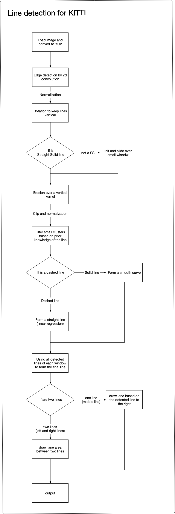

#### What is this for?

This rep will detect ego lane of current BEV(bird eye view) image following the convention of the KITTI UM-LANE challenge. 

This approach use no fancy machine learning or deep neural networks. All you need is basic python libs. Including:
- Opencv (no fancy functions, so all version should be compatible)
- Numpy
- SCIPY
- SKLearn

This approach is highly controllable over all complicated cases in the KITTI dataset. It worked specially good on dashed lines which is the dominant case in KITTI UM_LANE dataset. I used a sliding window to search for dashed lines. See the visualization example for more details.

# How to use

just run the detector.py, change the current_image_path to the path where your images stored and change vis_folder_prefix to the path where you want the visualization images to be stored. The result will be stored at "visualization/um_xxxxxx". The folder needs to be created before running the script.

## Explain of all parameters

All parameters are robust to a little offset to the real values of the images.

* min_over_hough: the minimal threshold for HoG value
* min_length: (only used for dashed lines) the minimal length threshold of each dashed line mark
* max_length: (only used for dashed lines) the maximal length threshold of each dashed line mark
* image_dimension: image dimension in a tuple of (height, width), for KITTI BEV images it is (800, 400)
* dash_interval_pxl: (only used for dashed lines) the distance between two dashed line marks
* line_list: a list of lines in the image, current script only support one or two lines in the list, see the script for more
* line_info: the information about those lines in line_list, see the script for more
* lane_width: used when there is only one left line given (assume right side driving), the width of current lane
* initial_angle: the initial angle of lines in radius
* max_turning_angle: the maximal turning angles for threshold of noise in a list of [minimal, maximal] in angles. Eg. [-100, 100]
* current_image_name: used for image reading, eg, 'um_000000'. If you want to read and save your own non-KITTI image, you will need to re-write the read and write function
* current_image_path: the image pre-fix for image storing location
* vis_folder_prefix: the folder where visualization images are stored
* step_window: if this is true, then the script will pause for an input after detection in each window. This gives a chance for step by step debug
* visualization: if this is true, then detailed visualization will be stored

# More details

Here is the full flow chart of the detection method.

This approach is based on the prior knowledge of:

## What is the lines types? 
The predesigned types are: 
- SS = Straight Solid line
- CD = Curved Dashed line
- CS = Curved Solid line
- SD = Straight Dashed line

## Where does the line start from?
given an approximated starting point in the image

See this paper "[A perception centred self-driving system without HD Maps](https://arxiv.org/abs/2009.00782)" for more discussion.

